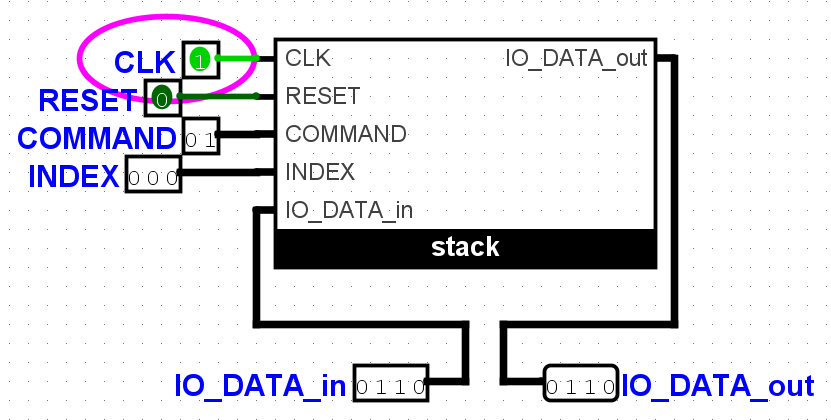

# verilog-logisim-stack
Здесь можно найти реализации поведенческого и структурного вариантов стека из 5 ячеек размером 4 бита на Verilog, а также тесты к ним. Логическая схема, описанная структурно на verilog, полностью соответствует схеме, выполненной в редакторе Logisim-evolution.
Данные материалы созданы в рамках [Лабораторной работы курса архитектуры ЭВМ](https://docs.google.com/document/d/1OeMx3kqlnsPXvEM71ERs5s8lm9Wqhu8WCjLSyzdhr3o/edit).
**Версии:** iverilog-v12-20220611, logisim-evolution v3.8.0.

